# Feel Good Gym overview

At Feel Good Gym, we believe that fitness is more than just exercise — it’s a lifestyle dedicated to strength, energy, and balance. Taking care of your body means investing in your long-term health, confidence, and happiness.

Regular workouts help you build muscle, burn fat, and improve flexibility, but the real benefits go beyond the mirror. Staying active boosts your mood, sharpens focus, and reduces stress, helping you feel better every day. Whether you enjoy lifting weights, joining group classes, or taking part in personal training sessions, every movement brings you one step closer to your goals.

Nutrition, rest, and mindset are just as important. That’s why we encourage a holistic approach — combining effective training programs with healthy eating habits and proper recovery. Our certified trainers and nutrition advisors are here to guide you, motivate you, and make sure your fitness journey is safe and enjoyable.

At Feel Good Gym, we’re not just helping you get fit — we’re helping you build a stronger, healthier version of yourself.

# Gym User Story

As a gym member I want view the available gym membership plans offered by the Feel Good Gym in order to choose the best one for me. View the gym's schedule that I can plan my visits to the gym. Choose the right trainers for my projected goals for my training. Read people testimonials or reviews so that I can make my own decision to suit my needs. View gym classes and book gym instructor. Contact the gym easily via a form so that I can ask questions. View photos and videos of the gym so that I can get a feel and a sense of the gym environment suitable for me.

# Gym User Nutrition Story (Not implemented at this stage)

As a gym member, I want to view my daily meals and see how they align with my fitness goals (e.g., muscle gain, fat loss, maintenance). Make proper decisions regarding my food diet to improve my performance and results in the gym.

# Gym Nutritionist Story (Not implemented at this stage)

As a gym nutritionist, I want to view my clients daily meals and see how they align with their fitness program. Create and assign meal plans to individual clients that includes calories, meal timing and varieties. View client meal profiles such as goals, preferences and allergies. Send client reports about their nutrition activities.

# Gym Instructor Story (Not implemented at this stage)

As a gym instructor member I want to view my class schedule so that I can manage my time. View who is registered for my classes so that I can prepare my classes accordingly. Update my program and specialties so that members know what I can offer. Track client progress so that I can provide better guidance. Send messages or updates to my clients to keep them engagged in the process

# Gym Admin Story (Not implemented at this stage)

As an gym admin I want to manage membership plans and pricing so that I can adjust them as needed. View all bookings and cancellations so I can manage gym capacity. Add, remove instructors to keep the site up-to-date. Generate reports on user activities and revenus that we can track performance. Manage website content, offers and announcements easily.

# Gym User Payment Story (Not implemented at this stage)

As a gym user I want to pay for my membership online so that I can save time. Update my update my payment method so that my membership renews automatically. View payment history and invoices so that I can track financial expenditure in the gym.

## Features

### Existing Features

- **Navigation Bar**

  - Featured on all three pages, the full responsive navigation bar includes links to the Logo, Home page, About, Classes, Contact, Insttructor, Memebership and Gallery page and is identical in each page to allow for easy navigation.
  - This section will allow the user to easily navigate from page to page across all devices without having to revert back to the previous page via the ‘back’ button.

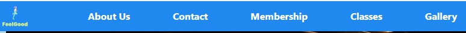

- **The landing page image**

  - The landing includes a photograph with text overlay to allow the user to see exactly which location this site would be applicable to.
  - This section introduces the user to Love Running with an eye catching animation to grab their attention

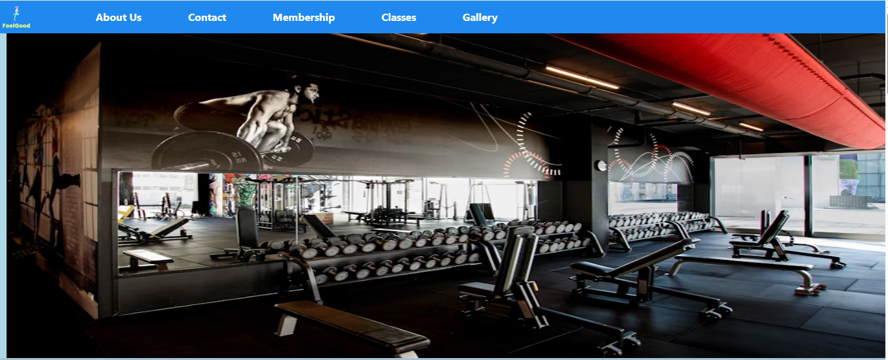

- **Feel Good Gym Information Section**

This information is about the Feel Good Gym Contact details

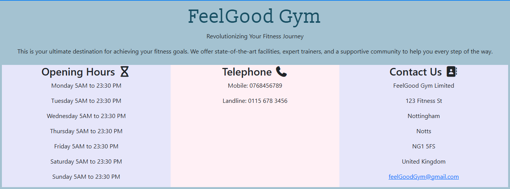

- **People testimonial Section**

This section is for people testimonial about our gym

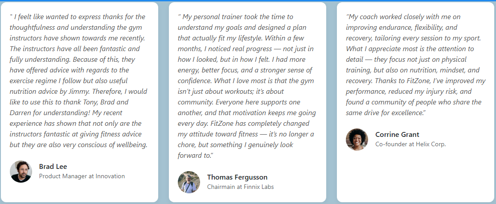

- **Location map Section**

This section is for the gym location which is just a fictitous one that needs updating with the real one.

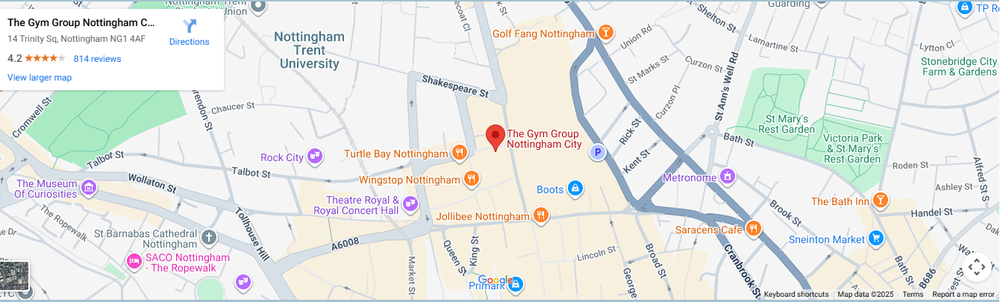

- **The Footer**

  - The footer section includes links to the relevant social media sites for Love Running. The links will open to a new tab to allow easy navigation for the user.
  - The footer is valuable to the user as it encourages them to keep connected via social media

- **The Contact Page**

  - This page will allow the user to get signed up to Love Running to start their running journey with the community. The user will be able specify if they would like to take part in road, trail or both types of running. The user will be asked to submit their full name and email address.

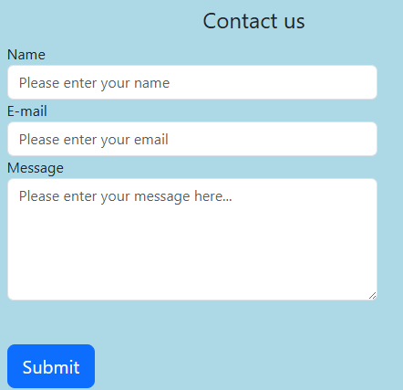

This page will allow you to record and enquire about anything relate to the gym.

- **The Membership Page**

  - This page will allow the user to show the different deals that available when joinning the feel good gym.

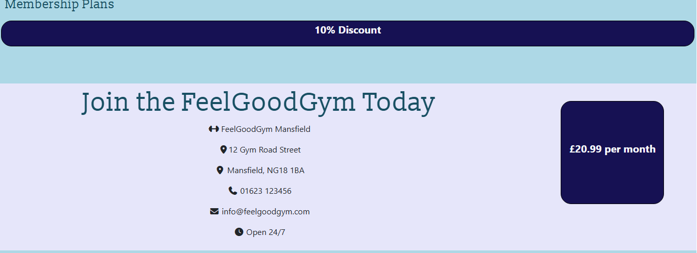

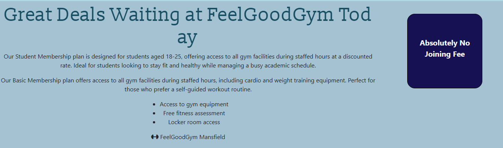
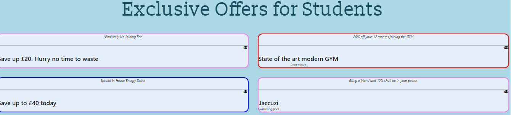
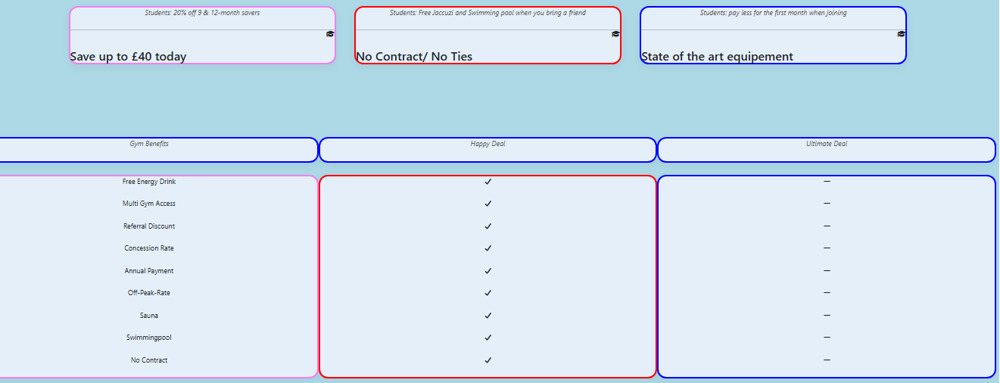

- **The Classes Page**

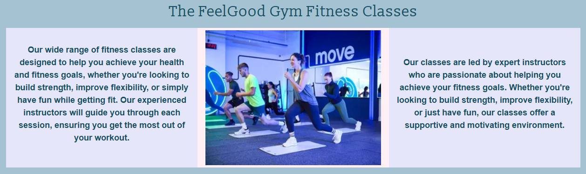

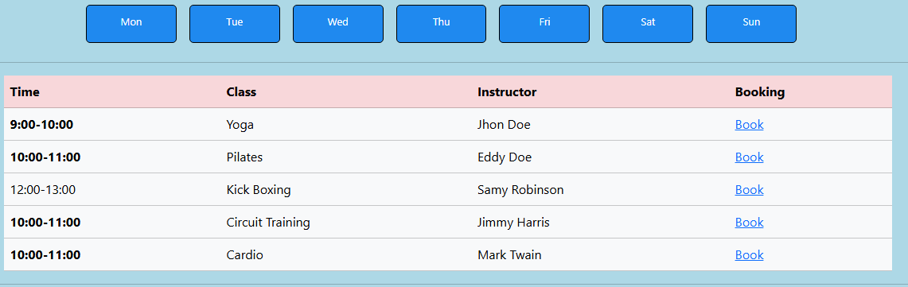

- **The Instructor Booking Page**

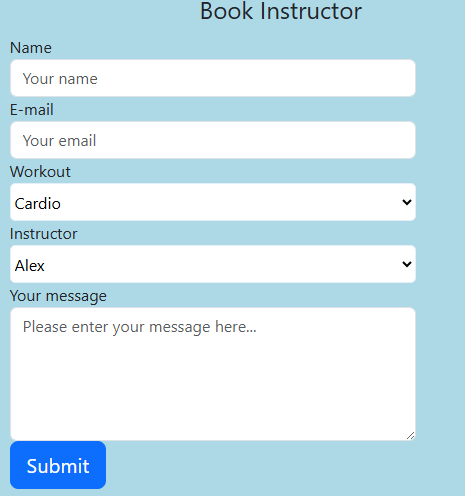

- **The Gallery Page**

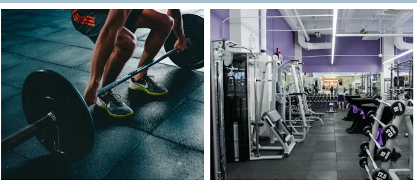

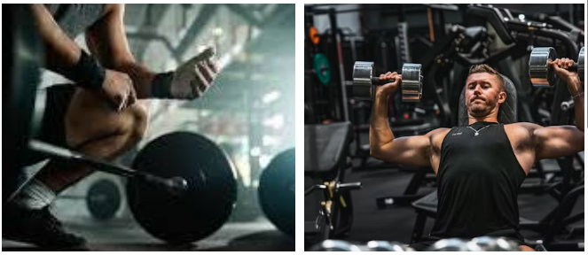

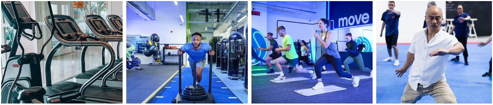

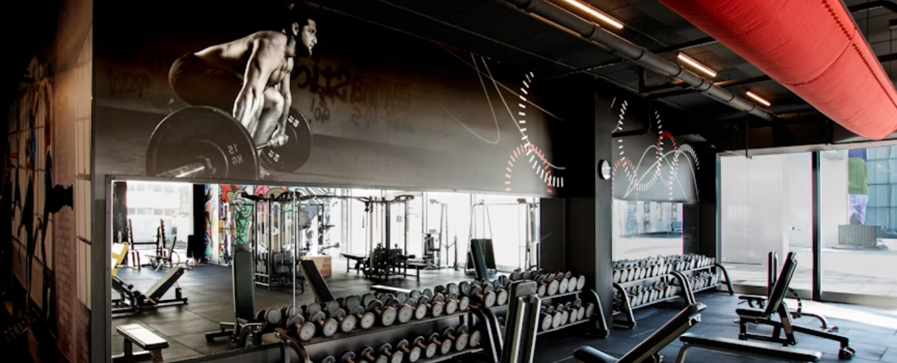

For some/all of your features, you may choose to reference the specific project files that implement them.

In addition, you may also use this section to discuss plans for additional features to be implemented in the future:

### Features Left to Implement

- Another feature idea

## Testing

**Home page**

I started my testing with large screen resolution but everthing works as it should be but my intention is to do the testing on different media. That is the real challenge where my code needs to cope with all the different screen configurations and resolutions.

In this section, you need to convince the assessor that you have conducted enough testing to legitimately believe that the site works well. Essentially, in this part you will want to go over all of your project’s features and ensure that they all work as intended, with the project providing an easy and straightforward way for the users to achieve their goals.

In addition, you should mention in this section how your project looks and works on different browsers and screen sizes.

You should also mention in this section any interesting bugs or problems you discovered during your testing, even if you haven't addressed them yet.

If this section grows too long, you may want to split it off into a separate file and link to it from here.

### Validator Testing

- HTML
  - No errors were returned when passing through the official [W3C validator](https://validator.w3.org/nu/?doc=https%3A%2F%2Fcode-institute-org.github.io%2Flove-running-2.0%2Findex.html)
- CSS
  - No errors were found when passing through the official [(Jigsaw) validator](https://jigsaw.w3.org/css-validator/validator?uri=https%3A%2F%2Fvalidator.w3.org%2Fnu%2F%3Fdoc%3Dhttps%253A%252F%252Fcode-institute-org.github.io%252Flove-running-2.0%252Findex.html&profile=css3svg&usermedium=all&warning=1&vextwarning=&lang=en#css)

### Unfixed Bugs

You will need to mention unfixed bugs and why they were not fixed. This section should include shortcomings of the frameworks or technologies used. Although time can be a big variable to consider, paucity of time and difficulty understanding implementation is not a valid reason to leave bugs unfixed.

## Deployment

This section should describe the process you went through to deploy the project to a hosting platform (e.g. GitHub)

- The site was deployed to GitHub pages. The steps to deploy are as follows:
- In the GitHub repository, navigate to the Settings tab
- From the source section drop-down menu, select the Master Branch
- Once the master branch has been selected, the page will be automatically refreshed with a detailed ribbon display to indicate the successful deployment.

The live link can be found here - https://Moh2700.github.io/gym

## Credits

### Content

**Bootstrap**

- [Bootstrap files] ("https://cdn.jsdelivr.net/npm/bootstrap@5.3.8/dist/css/bootstrap.min.css")
- [Bootstrap files] ("https://getbootstrap.com/docs/5.3/assets/css/docs.css")
- [Bootstrap files] ("https://cdn.jsdelivr.net/npm/bootstrap@5.3.8/dist/js/bootstrap.bundle.min.js)

**Fontawesome**

The icons in the footer were taken from

- [Font Awesome site] (https://fontawesome.com/)
- [Font awesome file] Javascript file to allow you to interact with fontawesome icons ("https://kit.fontawesome.com/dadada79ef.js")

### Media

- **Pexels and Unsplash website**

- The photos were taken from from This Open Source site
  [Pexels Site]("https://www.pexels.com/search/gym/") and
  [Unsplash Site]("https://unsplash.com/s/photos/gym")

- The photos used in the home, classes and aboutus page.
- The photos used on the home page .
- The images used for the gallery page.

## Other General Project Advice

Below you will find a couple of extra tips that may be helpful when completing your project. Remember that each of these projects will become part of your final portfolio so it’s important to allow enough time to showcase your best work!

- One of the most basic elements of keeping a healthy commit history is with the commit message. When getting started with your project, read through [this article](https://chris.beams.io/posts/git-commit/) by Chris Beams on How to Write a Git Commit Message

  - Make sure to keep the messages in the imperative mood

- When naming the files in your project directory, make sure to consider meaningful naming of files, point to specific names and sections of content.

  - For example, instead of naming an image used ‘image1.png’ consider naming it ‘landing_page_img.png’. This will ensure that there are clear file paths kept.

- Do some extra research on good and bad coding practices, there are a handful of useful articles to read, consider reviewing the following list when getting started:
  - [Writing Your Best Code](https://learn.shayhowe.com/html-css/writing-your-best-code/)
  - [HTML & CSS Coding Best Practices](https://medium.com/@inceptiondj.info/html-css-coding-best-practice-fadb9870a00f)
  - [Google HTML/CSS Style Guide](https://google.github.io/styleguide/htmlcssguide.html#General)

Getting started with your Portfolio Projects can be daunting, planning your project can make it a lot easier to tackle, take small steps to reach the final outcome and enjoy the process!
